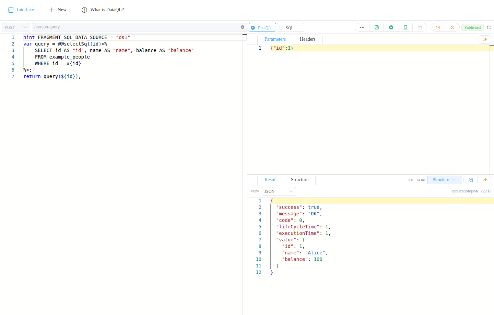

# Dataway

[中文](README.md) · [English](README.en.md)

An embedded data API framework for Java applications, combining data queries, transformation, aggregation, and API publishing.

[Website](https://www.dataql.net/en/) · [Documentation](https://www.dataql.net/en/docs/dataway/intro/overview) · [Blog](https://www.dataql.net/en/blog) · [AI Documentation Index](https://www.dataql.net/en/llms.txt)

## 📖 Introduction

Dataway provides a complete workflow from writing scripts to publishing APIs. Developers write data processing logic in SQL or DataQL, edit and debug it in the console, and publish APIs that applications can call over HTTP or directly from Java.

The built-in DataQL language and execution engine support database queries, Java service calls, data transformations, and aggregation across multiple sources. Use Dataway for dashboards, list and detail queries, form submissions, and service aggregation while reducing repetitive data access and API code.


## ✨ Features

### ⚙️ Framework Characteristics

- Embedded deployment: add JAR dependencies to an existing Java project, with integrations for Spring, Solon, and Hasor.
- Shared execution: SQL and DataQL use the same API management, parameter processing, interception, and result handling flow.
- Application integration: use your application's data sources, business services, login identities, and transaction management.
- Modular design: run the engine independently, deploy the console separately, and replace metadata storage or result handlers as needed.

### 🔋 Capabilities



- API management:
  - [Visual console](https://www.dataql.net/en/docs/dataway/capabilities/management): edit, debug, test, publish, and disable APIs, and view publication history.
  - [Programmatic management](https://www.dataql.net/en/docs/dataway/capabilities/programmatic): manage definitions and versions through Java interfaces or management HTTP APIs.
  - Draft changes take effect after publishing. Version checks detect concurrent updates.
- Data queries and transformation:
  - [DataQL language](https://www.dataql.net/en/docs/dataql/overview): use expressions, functions, and transformation templates to select fields, compute values, and build nested results.
  - [SQL executor](https://www.dataql.net/en/docs/dataway/dataql-engine/sql): queries, updates, dynamic SQL, pagination, type handling, and transactions.
  - [Data source integration](https://www.dataql.net/en/docs/dataway/capabilities/datasources): access multiple data sources by name and combine results from databases and application services.
- Requests and responses:
  - [Request parameters](https://www.dataql.net/en/docs/dataway/capabilities/development/request): accept URL parameters, JSON, forms, and uploaded files; read and write headers and cookies through Web functions.
  - [Result handlers](https://www.dataql.net/en/docs/dataway/capabilities/result-handlers): return structured results, raw values, CSV, text, and verification code images, with support for binary responses and custom handlers.
  - The console previews JSON, text, tables, and images according to the response type and supports file downloads.
- API invocation and documentation:
  - Call published APIs over HTTP or use [ApiService](https://www.dataql.net/en/docs/dataway/capabilities/development/java) to invoke them directly from Java by path or ID.
  - [Document generation](https://www.dataql.net/en/docs/dataway/capabilities/document): generate OpenAPI 3.x and Swagger 2.0 documents for browsing and API calls in Swagger UI.
- Identity and extensions:
  - [Authorization](https://www.dataql.net/en/docs/dataway/authorization): integrate your login system and control API access and management operations by identity.
  - [Admin interceptors](https://www.dataql.net/en/docs/dataway/configuration/admin-interceptors) and [API interceptors](https://www.dataql.net/en/docs/dataway/configuration/api-interceptors): add application logic such as auditing, validation, and caching.
  - [Engine extensions](https://www.dataql.net/en/docs/dataway/engine): register Java functions, application objects, code fragments, and custom scopes.
- Metadata storage:
  - Store API definitions, drafts, and publication records in [JDBC databases](https://www.dataql.net/en/docs/dataway/metadata/providers/jdbc) or [Nacos](https://www.dataql.net/en/docs/dataway/metadata/providers/nacos).
  - Customize table and field mappings, integrate application transactions, or implement a storage provider.

## 💡 Why Dataway?

- Less repetitive code: implement common data APIs with SQL and scripts, then debug parameters and preview results in the console.
- Results shaped for your application: query multiple data sources, call application services, and transform or aggregate their results in one API call.
- Integration with existing projects: retain your application's login, data source, and transaction configuration, and use a framework adapter to connect to its Web container.
- Extensible processing: add UDFs, code fragments, interceptors, and result handlers. The Java engine can also run independently.

## 🚀 Usage

### 1. Add Dependencies

For a Spring Boot project, add the framework integration, JDBC metadata storage, and SQL execution extension:

```xml
<!-- Spring integration, including the core and console resources -->
<dependency>
    <groupId>net.hasor</groupId>
    <artifactId>dataway-spring</artifactId>
    <version>5.0.0</version>
</dependency>
<!-- Store API definitions and publication records -->
<dependency>
    <groupId>net.hasor</groupId>
    <artifactId>dataway-meta-jdbc</artifactId>
    <version>5.0.0</version>
</dependency>
<!-- SQL execution -->
<dependency>
    <groupId>net.hasor</groupId>
    <artifactId>dataql-sqlproc</artifactId>
    <version>5.0.0</version>
</dependency>
```

Configure identity resolution, database connections, and script extensions through `DatawayConfig`, and connect metadata storage through `ApiDataAccessLayer`. See [Quick Start](https://www.dataql.net/en/docs/dataway/intro/quickstart) for the complete configuration. The [Spring example](example/dataway-spring-example) includes data initialization, login, the console, and Swagger UI.

### 2. Code Examples

#### SQL Query API

Create `POST /person-query` with the DataQL script type. This script uses the `ds1` data source and binds the request parameter `id` to SQL:

```javascript
hint FRAGMENT_SQL_DATA_SOURCE = "ds1"
var query = @@selectSql(id)<%
    SELECT id AS "id", name AS "name", balance AS "balance"
    FROM example_people
    WHERE id = #{id}
%>;
return query(${id});
```

Save and publish the API, then sign in through the Spring example's login endpoint to obtain a cookie and call the API:

```bash
curl -c cookies.txt -X POST http://127.0.0.1:8080/session/login \
  -d 'username=admin&password=example-password'

curl -b cookies.txt http://127.0.0.1:8080/api/person-query \
  -H 'Content-Type: application/json' \
  -d '{"id":1}'
```

The default Structure handler wraps the response. Its `value` field contains the query result:

```json
{"id": 1, "name": "Alice", "balance": 100}
```

#### Data Transformation

Use a DataQL transformation template to select fields and compute new values. The `people` variable can also hold the result of a SQL query or an application function:

```javascript
var people = [
    {"name": "Alice", "age": 25},
    {"name": "Bob", "age": 30}
];

return people => [{
    "name",
    "nextAge": age + 1
}];
```

The script returns:

```json
[
    {"name": "Alice", "nextAge": 26},
    {"name": "Bob", "nextAge": 31}
]
```

#### Calling APIs from Java

Obtain the configured `Dataway` instance from the application container, then use `ApiService` to call published, enabled APIs. Use the path from the API definition, without the HTTP entry prefix `/api`:

```java
import java.util.Map;
import net.hasor.dataway.model.ResultInfo;
import net.hasor.dataway.service.script.ApiService;

ApiService api = dataway.getApiService();
Map<String, Object> parameters = Map.of("id", 1);
ResultInfo result = api.invokeByPath("POST", "/person-query", parameters);

System.out.println(result.getData());
```

Java calls use the same API interceptors, parameter processing, and result handlers. Use `invokeById` to call an API by its ID.

## 📚 Resources

- [Website](https://www.dataql.net/en/), [Quick Start](https://www.dataql.net/en/docs/dataway/intro/quickstart), and [Documentation](https://www.dataql.net/en/docs/dataway/intro/overview).
- Framework integrations: [Spring](https://www.dataql.net/en/docs/dataway/integration/spring), [Solon](https://www.dataql.net/en/docs/dataway/integration/solon), and [Hasor](https://www.dataql.net/en/docs/dataway/integration/hasor).
- Example projects: [Spring + JDBC](example/dataway-spring-example), [Solon + JDBC](example/dataway-solon-example), [Hasor + JDBC](example/dataway-hasor-example), and [Spring + Nacos](example/dataway-spring-nacos-example).
- Language and engine: [DataQL Language Reference](https://www.dataql.net/en/docs/dataql/overview), [Standalone Engine](https://www.dataql.net/en/docs/dataway/dataql-engine), and [Data Processing Examples](example/dataql-blog-example).
- [Blog](https://www.dataql.net/en/blog) and [AI Documentation Index](https://www.dataql.net/en/llms.txt).
- [Developer Guide (Chinese)](community/README.md): repository structure, prerequisites, builds, tests, and documentation maintenance.

## 📄 License

Dataway is licensed under the [Apache License 2.0](LICENSE.txt).
