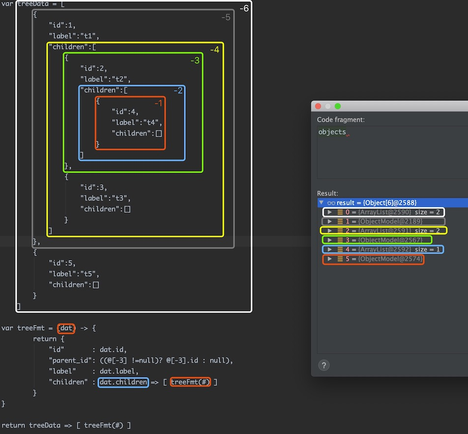

# 值域

值域是一种隔离机制。例如：同样名称的参数可以出现在不同的 `域` 里，在 DataQL 中一共有三个可以用的值域符号：

- `$` 值域符
- `#` 值域符
- `@` 值域符

:::tip
DataQL 的值域，在没有明确分别它们的时候。三个访问符的值域内容是没有任何区别的。
:::

值域符的应用场景只有两个
- 值域参数隔离
- 表达式访问符

## 值域参数隔离

获取程序传入的参数必须使用：`<访问符>{<参数名>}` 方式来获取。这个特性类似带参的SQL，例如：

```js title='用不同值域隔离同名参数的例子'
// 创建一个 Map 为每个值域中都放入不同变量，但是变量名都是 'a'
Map<String, Map<String, Object>> objectMap = new HashMap<>();
objectMap.put("#", new HashMap<String, Object>() {{
    put("a", 1);
}});

objectMap.put("$", new HashMap<String, Object>() {{
    put("a", 2);
}});

objectMap.put("@", new HashMap<String, Object>() {{
    put("a", 3);
}});
```

然后通过 Query 接口创建查询并执行查询（通过 `CustomizeScope` 接口来返回不同访问符的数据 Map）

```js title='${abc}、@{abc}、#{abc} 三个值域'
DataQL dataQL = ...
Query query = dataQL.createQuery("return [#{a},${a},@{a}];");
DataModel dataModel = query.execute(new CustomizeScope() {
    public Map<String, ?> findCustomizeEnvironment(String symbol) {
        return objectMap.get(symbol);
    }
}).getData();
```

```js title='查询结果'
[1, 2, 3]
```

## 表达式访问符

表达式访问符同样使用了 `@`、`#`、`$` 三个符号，在表达式中的访问符是指类似如下的取值表达式：

```js
$ss.sss.sss
#ss[abc].sss.sss
@abc.abc(true).sss
```

表达式中的访问符不同含义如下：
- `$` 表示环境栈根
- `#` 表示环境栈顶
- `@` 表示整个环境栈(数组形态)

要理解这种带有访问符的含义需要理解 DataQL 的运行模式，DataQL 的运行时模型和 JVM 有些类似。

不同的是 DataQL 采用的是两栈一堆。比 JVM 堆栈模型多了一个 `环境栈`。
- **环境栈**
- **运行栈**(作用和 JVM 相似)
- **数据堆**(作用和 JVM 相似)

查询过程中一般情况下环境栈始终是空的，当遇到 `=>` 操作时。
DataQL 会把 `=>` 符左边的表达式值放入环境栈，当转换结束时 DataQL 会把表达式值从环境栈中删掉。
如果在转换过程中遇到第二次 `=>` 操作，那么会在环境栈顶中放入新的数据。例如：下面这个查询就会出现双层环境栈

```js title='一个DataQL查询'
var data = {
    "userInfo" : {
        "username" : "xxxxx",
        "password" : "pass"
    },
    "basicInfo" : {
        "name" : "马三",
        "sex"  : "F"
    },
    "id" : 12345667
}

return data => { // 第一次出现
    "userInfo" : userInfo => { // 第二次出现
        "username",
        "password",
        "userId" : $.id
    },
    "name" : basicInfo.name // 这种形式不会出现
}
```

```json title='执行结果为'
{
    "userInfo":{
        "username":"xxxxx",
        "password":"pass",
        "userId":12345667
    },
    "name":"马三"
}
```

:::tip
所有表达式在编译的时都会有一个访问符，如果用户没有指定那么将会使用 `#` 作为默认访问符。

即便所有表达式在编译之后都具有访问符，但这并不代表数据的源头都来自环境栈。编译器会优先在本地变量表中查找。具体逻辑在 `NameRouteVariableInstCompiler` 类中。
:::

例如：如下例子，在对一颗 `Tree` 进行结构变换时。希望每一层都能带上 `parentID`。

```js title='样本数据'
[
  {
    "id": 1,
    "label": "t1",
    "children": [
      {
        "id": 2,
        "label": "t2",
        "children": [
          {
            "id": 4,
            "label": "t4",
            "children": []
          }
        ]
      },
      {
        "id": 3,
        "label": "t3",
        "children": []
      }
    ]
  },
  {
    "id": 5,
    "label": "t5",
    "children": []
  }
]
```

```js title='DataQL 查询'
var treeData = ..// 样本数据
var treeFmt = (dat) -> {
    return {
        "id"       : dat.id,
        "parent_id": ((@[-3] !=null)? @[-3].id : null), // 获取整个环境栈然后在倒数第三层上获取
        "label"    : dat.label,
        "children" : dat.children => [ treeFmt(#) ]
    }
}
return treeData => [ treeFmt(#) ]
```

参照数据 `@[-3]` 含义如下：

