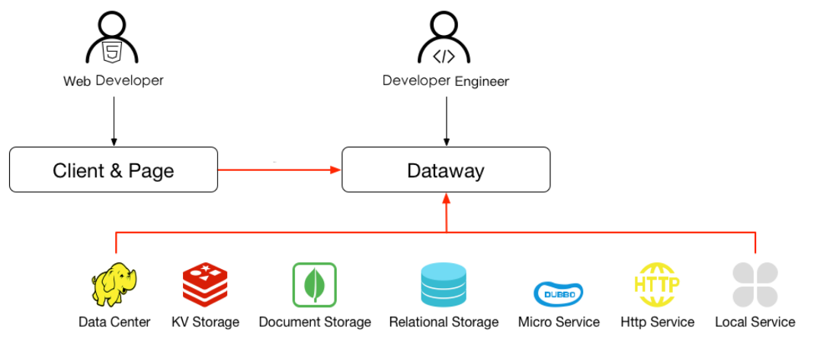
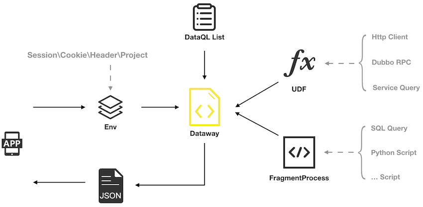

# 什么是Dataway?

Dataway 是依托 DataQL 服务聚合能力，为应用提供一个 UI 界面。并以 jar 包的方式集成到应用中。 通过 Dataway 可以直接在界面上配置和发布接口。

这种模式的革新使得开发一个接口不必在编写任何形式的代码，只需要配置一条 DataQL 查询即可完成满足前端对接口的需求。 从而避免了从数据库到前端之间一系列的开发配置任务，例如：Mapper、DO、DAO、Service、Controller 统统不在需要。

Dataway 特意采用了 jar 包集成的方式发布，这使得任意的老项目都可以无侵入的集成 Dataway。 直接改进老项目的迭代效率，大大减少企业项目研发成本。

Dataway 工具化的提供 DataQL 配置能力。这种研发模式的变革使得，相当多的需求开发场景只需要配置即可完成交付。从而避免了从数据存取到前端接口之间的一系列开发任务，例如：Mapper、BO、VO、DO、DAO、Service、Controller 统统不在需要。

如上图所示 Dataway 在开发模式上提供了巨大的便捷。虽然工作流程中标识了由后端开发来配置 DataQL 接口，但这主要是出于考虑接口责任人。但在实际工作中根据实际情况需要，配置接口的人员可以是产品研发生命周期中任意一名角色。

# 主打场景

主打场景并不是说 Dataway 适用范围仅限于此，而是经过多次项目实践。我们认为下面这些场景会有非常好的预期效果。

比如说 **取数据** 在一些报表、看板项目中即便是取数据逻辑在复杂。我们依然做到了真正的 零 开发，所有取数逻辑全部通过 DataQL + SQL 的方式满足。

对比往期项目对于后端技术人员的需求从 3～5 人的苦逼通宵加班，直接缩减为 1 人配置化搞定。

再比如，某个内部类 ERP 项目，20 多个表单页面，后端部分仅有 1000 行左右的核心代码。其它数据存取逻辑全部配置化完成。

**取数据**

如果你只想从数据库或者服务中获取某类数据，不需要：VO、BO、Convert、DO、Mapper 这类东西。

**存数据**

如果是从页面表单递交数据到数据库或者服务，免去 BO、FormBean、DO、Mapper 这类东西。

**数据聚合**

基于服务调用结果经过结构转换并响应给前端。将数据库和服务等多个结果进行汇聚然后返回给前端。

# 技术架构

