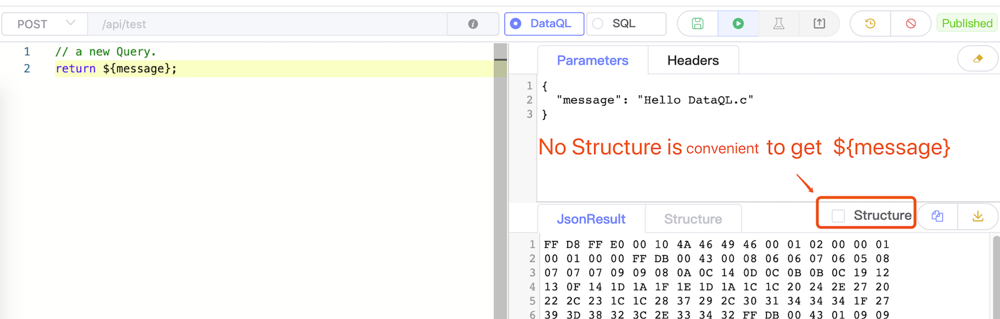
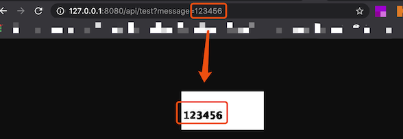

# SerializationChainSpi

是 4.1.7 加入的新特性，这个接口允许开发者自定义 Dataway 结果的序列化逻辑。

它的使用场景如下：
- 修改 JSON 序列化的规则，例如：不输出为空的列。
- 自定义输出格式。例如：使用 XML来作为响应结果，或者使用 RPC 的序列化协议

**不输出为空的属性**

```js
public class CustomSerializationSpi implements SerializationChainSpi {
    public Object doSerialization(ApiInfo apiInfo, MimeType mimeType, Object result) {
        return JSON.toJSONString(result);
    }
}

// DataQL 查询

// return {
//     "a" : null,
//     "b" : ${message}
// };

// Result
// {
//   "success": true,
//   "message": "OK",
//   "code": 0,
//   "lifeCycleTime": 3,
//   "executionTime": 0,
//   "value": {
//     "b": "Hello DataQL." // only b exists
//   }
// }
```

**自定义序列化，例如：使用Xml呈现**

```js
public class CustomSerializationSpi implements SerializationChainSpi {
    public Object doSerialization(ApiInfo apiInfo, MimeType mimeType, Object result) {
        XStream xStream = new XStream(new DomDriver());
        return xStream.toXML(result);
    }
}

// DataQL 查询
//
// return {
//     "a" : null,
//     "b" : ${message}
// };
//
// Result
// <linked-hash-map>
//   <entry>
//     <string>success</string>
//     <boolean>true</boolean>
//   </entry>
//   <entry>
//     <string>message</string>
//     <string>OK</string>
//   </entry>
//   <entry>
//     <string>code</string>
//     <int>0</int>
//   </entry>
//   <entry>
//     <string>lifeCycleTime</string>
//     <long>34</long>
//   </entry>
//   <entry>
//     <string>executionTime</string>
//     <long>0</long>
//   </entry>
//     <entry>
//       <string>value</string>
//       <linked-hash-map>
//         <entry>
//           <string>a</string>
//           <null/>
//         </entry>
//         <entry>
//           <string>b</string>
//           <string>Hello DataQL.c</string>
//         </entry>
//       </linked-hash-map>
//   </entry>
// </linked-hash-map>
```

**二进制序列化**

SerializationChainSpi 接口在序列化的时候，允许用户自己对数据进行任意形态的序列化操作。通过 http 响应用户的序列化结果时，还需要考虑 context-type 的问题。
这时就可以考虑使用 SerializationInfo 类型来将 context-type 携带给 Dataway。

```js
public class CustomSerializationSpi implements SerializationChainSpi {
    public Object doSerialization(ApiInfo apiInfo, MimeType mimeType, Object result) {
        BufferedImage bi = new BufferedImage(150, 70, BufferedImage.TYPE_INT_RGB); //高度70,宽度150
        Graphics2D g2 = (Graphics2D) bi.getGraphics();
        // background color
        g2.fillRect(0, 0, 150, 70);
        g2.setColor(Color.WHITE);
        // text
        g2.setFont(new Font("宋体", Font.BOLD, 18));
        g2.setColor(Color.BLACK);
        g2.drawString(String.valueOf(result), 3, 50);
        // save to bytes
        ByteArrayOutputStream oat = new ByteArrayOutputStream();
        ImageIO.write(bi, "JPEG", oat);
        //
        return SerializationChainSpi.SerializationInfo.ofBytes(//
            mimeType.getMimeType("jpeg"),   // response context-type
            oat.toByteArray()               // response body
        );
    }
}
```

此时作为二进制输出，UI 界面会自动将二进制数据以十六进制字符串形式展示。我们可以点击 下载 按钮把，十六进制数据保存为本地文件。



接口发布之后调用这个接口就可以看到一个配置的 API 将返回值顺利的渲染成了 图片。


